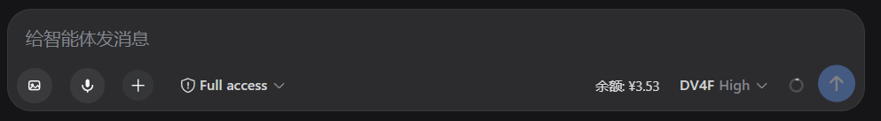
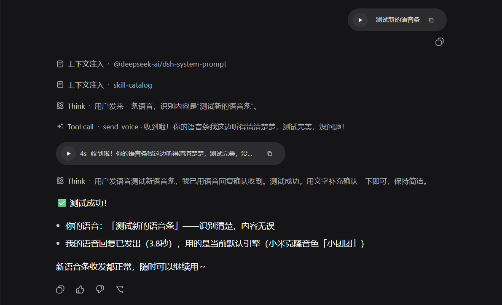
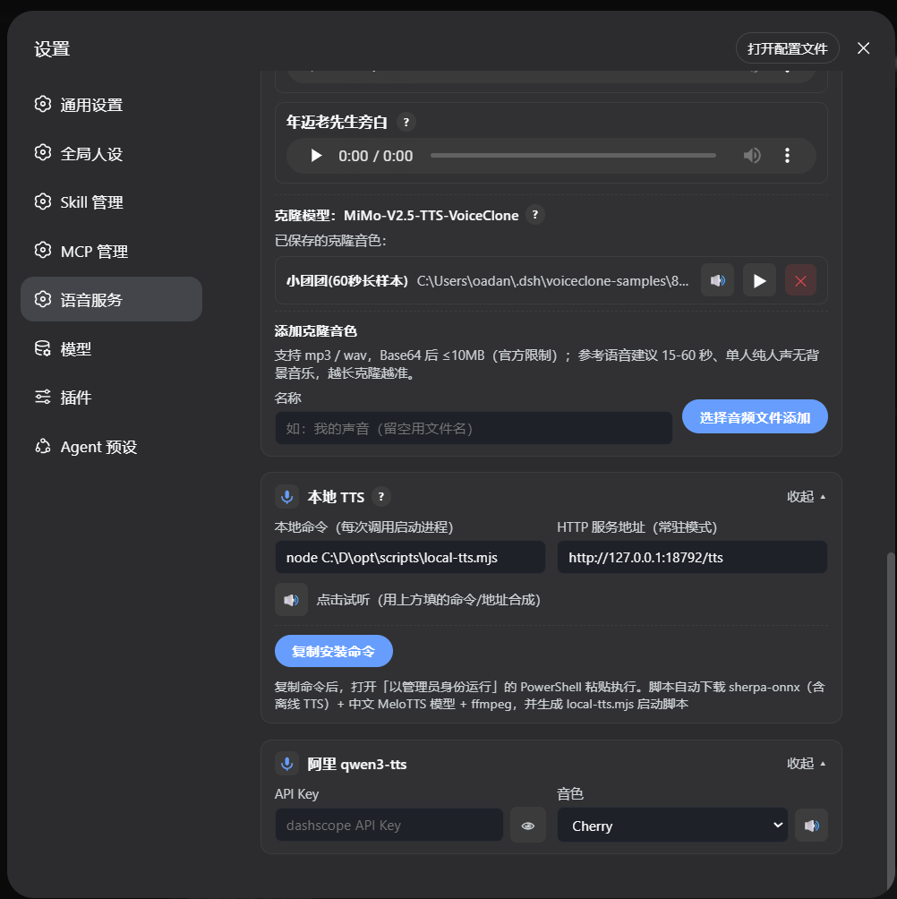

# DeepSeek Harness 语音增强版

> 一句话定位：**给 DSH 配上眼睛、耳朵和嘴巴——而且全部免费。**

给 **DeepSeek Harness**（本地 AI 助手）装上完整的感官能力：

- 👀 **眼睛**：模型看不了图时，自动交给本地视觉模型识别（文本模型也能发图识图）
- 🎙️ **耳朵**：你说话 → 自动识别成文字（本地离线 ASR，不依赖云）
- 🔊 **嘴巴**：AI 用语音回复你（微软免费 / 小米 / 本地离线 / 音色克隆 / 阿里）
- 🗣️ **克隆音色**：用你自己的声音说话
- 💰 **零成本**：以上全部能力免费——本地部署优先，无需任何云端 API 付费 Key

本项目基于官方 [DeepSeek Harness](https://github.com/deepseek-ai/deepseek-harness)（MIT 协议）二次开发，语音能力来自独立插件 [@oadank/dsh-input-tools](https://github.com/oadank/dsh-input-tools)。

> **为什么本项目要改官方源码？** 官方 dsh 对图片/语音只有一个态度：模型支持就直接发，不支持就报错——纯文本模型（如 deepseek-v4-flash）**根本用不了图片和语音**。外置插件（如 modlens，其 README 自述："the pasted image lands as a private temp file and its path enters the composer"，且代码中无官方发图链路 intakeImages/onAddImages 的接入）**以"粘贴"为图片入口**：粘贴时图片落临时文件、路径文本进输入框、由它自己的 `modlens_read_image` 工具读取；普通按钮选图（官方 intakeImages 链路）、语音带图等入口它覆盖不到；①模式聊天里是路径文本而非标准图片消息（②选 modlens vision 模型时保留缩略图）。本项目在框架层把图片块统一转成"本地附件路径文本"（`serialize.ts` 等）并移除官方"模型不支持图片即拒绝"的闸门，让**任何入口**的图片/语音都能被文本模型用插件工具识别，同时保留完整图片消息体验。详见[插件 README 架构说明](https://github.com/oadank/dsh-input-tools)。
>
> 📋 **源码修改记录表**（每次测试/改动，都更新这张表；大白话版）：
>
> | # | 文件 | 改了啥（大白话） | 为啥改 | 状态 |
> |---|---|---|---|---|
> | 1 | `packages/llm/llm-deepseek/src/serialize.ts` | 发图片不再报错拒绝，改成把图片转成一行"图片在本地哪个文件"的文字 | 纯文本模型收不到图，要给它图片路径文字，它才能调插件识图工具去看图 | ✅ |
> | 2 | `packages/host/apiproxy/src/api-proxy.ts` | 发图时不再检查"这个模型支不支持图片"，一律放行 | 图是转成文字给模型的，模型不需要真的支持图 | ✅ |
> | 3 | `packages/llm/llm-deepseek/src/adapter.ts` | 组装模型请求前，不再因为"模型不支持图"直接拒绝 | 这是最靠前的拦截点，不放行图根本走不到第 1 步的转换 | ✅ |
> | 4 | `packages/host/apiproxy/src/api/sessions.ts` | 聊天接口的输入类型里加"语音"这种消息 | 官方不认语音消息，加上才能发原生语音 | ✅ |
> | 5 | `packages/host/apiproxy/src/api/sessions.schema.ts` | 接口的校验规则加语音 | 跟第 4 条配套 | ✅ |
> | 6 | `packages/host/apiproxy/src/api-proxy.ts` | 收到语音消息 → 自动存盘 + 本地识别成文字 | 官方不认识语音，要转成文字给模型看 | ✅ |
> | 7 | `packages/llm/llm/src/types.ts` | 消息类型表里加"语音块" | 跟第 4 条配套 | ✅ |
> | 8 | `packages/host/apiproxy/src/voice.ts`、`edge-tts.ts`（**新增**） | 从本地搬来语音存盘 / 识别 / 合成的基础代码 | 官方源码根本没有语音基础设施，整条链路是我们加的 | ✅ |
> | 9 | `packages/llm/llm-deepseek/src/serialize.ts` | 语音消息转成"识别出的文字" | 模型看不懂语音，给它文字它才知道你说的啥 | ✅ |
> | 10 | `packages/host/apiproxy/src/api/balance.ts`、`balance.schema.ts`（**新增**）+ `rpc-map.ts`、`api/index.ts`、`api-proxy.ts`、`fetch/client.ts`、`fetch/handler.ts`、`index.ts`、测试 mock 共 9 处 | 加"查余额"接口（RPC） | 官方没有查余额接口；**插件的余额显示只是界面，数据要调这个接口拿**，接口在源码里必须有 | ✅ |
> | 11 | `packages/client/ui-conversation/src/client/skeleton/InputBar.tsx` | 插件图标（图片/语音）从权限按钮后面挪到命令 `+` 前面 | 用户要求按钮顺序是 [🖼][🎙][+] | ✅ |
> | 12 | `packages/host/apiproxy/package.json` | 加 `ws`、`@types/ws` 依赖 | Edge TTS 合成语音要连微软 WebSocket 服务 | ✅ |
> | 13 | `packages/core/session/src/types.ts`、`known-event-types.ts` + `packages/host/apiproxy/src/api-proxy.ts` + `api/sessions.ts`、`sessions.schema.ts`、`rpc-map.ts`、`fetch/client.ts`、`fetch/handler.ts` + `packages/client/runtime/.../session.ts`、`contract/session.ts` + `packages/client/connection/.../api.ts`、`index.ts` + `api/index.ts` | 加"读语音对象"接口（`session.voice` RPC 全链路：host 读语音文件 → 客户端拿字节） | 前端要播放历史语音消息，得能从会话里把语音文件读回来 | ✅ 实测读回 257KB |
> | 14 | 前端 **client lib 重建**（`build:lib:client` + `build:web`）：InputBar 图标位置、`balance.get`/`session.voice` 前端 API 面、测试 mock（fake-api/fixture 加 balance/voice/readVoice） | 之前只跑 `build:web` 用的是旧 lib——**前端改动全没生效**（图标位置没变、余额不显示的根因）。正确流程：改 ui-conversation/connection 等前端 src → 先 `build:lib:client` 再 `build:web` | 前端组件是运行时插件（lib/client.js），apps/web 只是壳 | ✅ 实测：语音回复触发 + 余额 RPC 3.31 |
>
> **还在路上**：官方前端不渲染语音消息（显示成原始 JSON、AI 语音回复无条幅）——需要把本地的语音消息渲染层（MessageItem 气泡 VoiceCard / TtsVoiceCard / VoiceReplyNodeView 等约 6-8 个文件）搬到官方前端。**数据链路已通**（`session.voice` RPC 实测读回 257KB），下一步是前端组件渲染。
>
> 详细版本（含每处提交号）：[docs/LOCAL-MODIFICATIONS.md](docs/LOCAL-MODIFICATIONS.md)

> 只想用官方原版？见[官方仓库](https://github.com/deepseek-ai/deepseek-harness)。
> 注意：官方版是快速迭代的开发者预览版，且**没有本项目的语音功能**（语音能力来自本项目的插件）。
> 本项目的安装见下文「一、安装」，按步骤装完就是正式安装，不会丢。

> ⚠️ **重要：别被 `npx` 误导——它不是安装；而且官方版 ≠ 本项目**
>
> - 官方文档写的 `npx @deepseek-ai/dsh web` 只是**临时运行**（下载到 npm 缓存拉起跑，没有全局 `dsh` 命令，每次都要重新解析）；想正式安装官方版：`npm install -g @deepseek-ai/dsh`，之后直接运行 `dsh web`。
> - 但**无论临时还是正式，官方版都是独立产品线**：它是预编译的发行包（只有编译产物、没有源码，无法加装本项目的改造），**没有本项目的语音/克隆功能**；本项目的语音插件是配合本 fork 开发测试的，在官方发行包上**不保证兼容**。
> - 不管哪种方式，你的数据（会话、配置）都存在 `~/.dsh`，**不会丢**。
> - **想用语音功能 → 装本项目**（下面「一、安装」），装完就是正式安装。

## 界面预览

**输入框工具条**（左起：图片/🎙 录音/+/权限/余额/模型）



**语音消息**（录音后自动识别成文字发送，AI 也能用语音回）



**语音能力与 ASR 配置**（引擎选择、音色设计、克隆、ASR）


**TTS 引擎设置**（小米 / 本地 MeloTTS / 阿里 三选）

| 小米 TTS | 本地 TTS / 阿里 |
|---|---|
|  |  |

---

## 一、安装

### 方式 A：Windows

**前置准备**（没有才装，已装跳过。在 PowerShell 里逐条复制运行）：

```powershell
# 1. Git（版本管理工具）
winget install --id Git.Git -e --source winget

# 2. Node.js（自带 npm；要求 22.19 或更高，24 也可以）
winget install --id OpenJS.NodeJS.LTS -e --source winget

# 3. 装完 Node.js 后【重开 PowerShell】让命令生效，然后装 pnpm
npm install -g pnpm
```

装完检查一下（应该都能打印出版本号，没有就重开终端再试）：

```powershell
git --version; node -v; npm -v; pnpm -v
```

然后**整段复制运行**下面的安装步骤：

```powershell
# 1. 下载代码
git clone https://github.com/oadank/deepseek-harness.git
cd deepseek-harness

# 2. 安装依赖 + 编译（首次约 5~10 分钟，耐心等）
pnpm install
pnpm run build:lib
pnpm run build:web

# 3. 安装语音插件（自动从 npm 下载并注册）
powershell -ExecutionPolicy Bypass -File scripts\setup-profile.ps1

# 4. 启动（浏览器自动打开 http://127.0.0.1:3080）
node --import tsx/esm apps/cli/src/bin.ts web --no-open --port 3080
```

### 方式 B：Linux / macOS

**前置准备**（没有才装，已装跳过）：

```bash
# Debian / Ubuntu：
sudo apt update && sudo apt install -y git
curl -fsSL https://deb.nodesource.com/setup_24.x | sudo -E bash - && sudo apt install -y nodejs
# macOS（需先装 Homebrew，见 https://brew.sh）：
#   brew install git node
# 装完 Node.js 后（npm 随 Node 自带）：
npm install -g pnpm
```

然后**整段复制运行**：

```bash
git clone https://github.com/oadank/deepseek-harness.git
cd deepseek-harness
pnpm install
pnpm run build:lib
pnpm run build:web
bash scripts/setup-profile.sh
node --import tsx/esm apps/cli/src/bin.ts web --no-open --port 3080
```

> 💡 想 24 小时后台运行（像服务器一样常驻）？Windows 用 nssm、Linux 用 systemd，
> 完整步骤见 [INSTALL.md](INSTALL.md)。

---

## 二、懒得自己装？让 AI 帮你装

把下面这段话**原样发给**任意 AI 助手（ChatGPT、DeepSeek、豆包……），它会照着一步步帮你装完：

> 请帮我在电脑上安装 DeepSeek Harness 语音增强版。
> 项目地址：https://github.com/oadank/deepseek-harness
> 安装教程：https://raw.githubusercontent.com/oadank/deepseek-harness/master/INSTALL.md
> 我的系统是 Windows / Linux / macOS（请删掉不适用的）。
> 请先检查 Git、Node.js（>=22.19）、pnpm 是否装好，没装就先装；
> 然后严格按教程一步步执行，每完成一大步就告诉我结果；
> 遇到任何报错先停下来分析原因，不要跳过；装完帮我启动并验证能用。

---

## 三、装完怎么用

1. 浏览器打开 http://127.0.0.1:3080
2. 输入框左侧有 **[🎙] 录音按钮**：按住说话，松开自动识别成文字发出去
3. 打开 **设置 → 语音服务**：选语音引擎（微软免费开箱即用 / 小米 / 本地离线）、调音色、克隆声音
4. 想让 AI 用语音回答：直接对它说"用语音回答我"即可

---

## 四、常见问题

| 问题 | 解决 |
|---|---|
| 启动报错提示要先编译 | 全新 clone 必须先 `pnpm run build:lib`，不能跳过 |
| 语音条点了没声音 | 检查 ffmpeg：Windows 运行 `winget install ffmpeg` |
| 端口 3080 被占用 | 启动命令加 `--port 3081` |
| 想开机自启 / 远程访问 / 换语音引擎 | 看 [INSTALL.md](INSTALL.md)，含完整排障 |

---

## 与官方版的关系

- 本项目 = 官方 [deepseek-harness](https://github.com/deepseek-ai/deepseek-harness) + 语音插件 [@oadank/dsh-input-tools](https://github.com/oadank/dsh-input-tools)
- 插件独立维护、从 npm 安装：升级项目不影响插件，反之亦然
- 本项目不与上游合并（含个人本地化偏好），按需跟随官方更新

## 致谢

- [DeepSeek Harness](https://github.com/deepseek-ai/deepseek-harness)（DeepSeek AI，[MIT](LICENSE)）
- [Cordis](https://github.com/cordiverse/cordis) 插件框架
